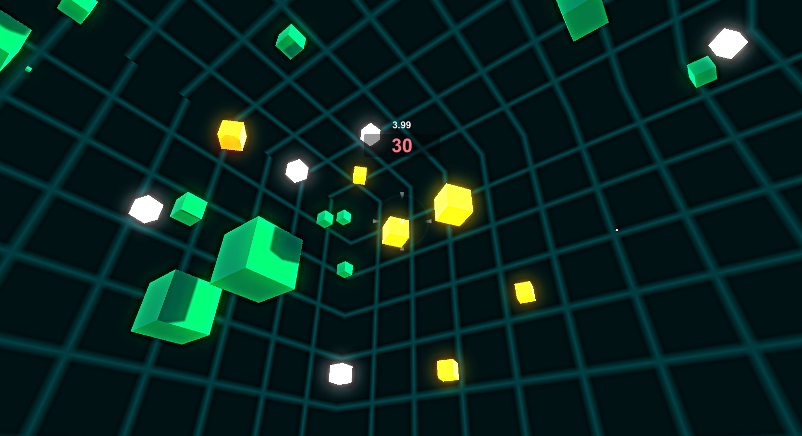
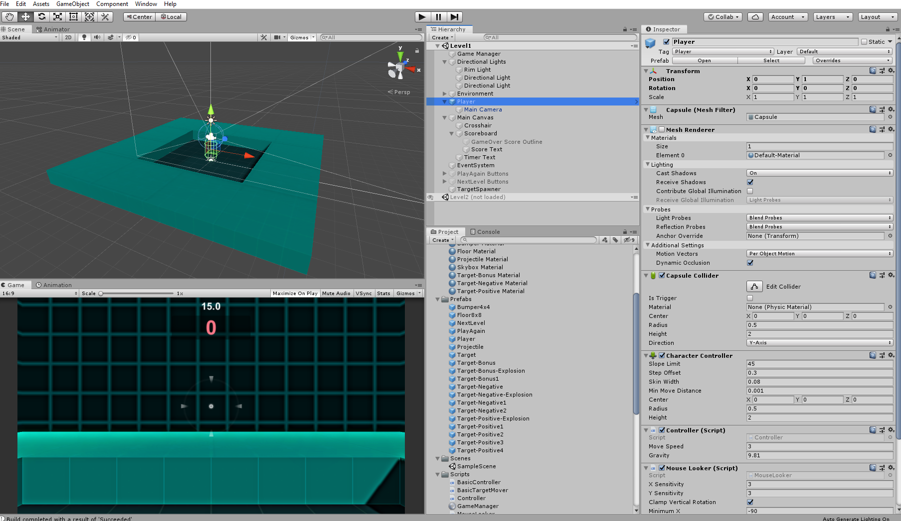

# Unity3D_BoxShooter_WebGL

WebGL build of a Unity3D game hands-on miniproject: a simple FPS for target practice.

The goal was to learn how to create a basic game with Unity3D and work with C# scripts.

Working WebGL live app can be found [here](https://romxz-boxshooterwebgl.glitch.me/). Based on a project of [this](https://www.coursera.org/learn/game-development) course on GameDev with Unity.

